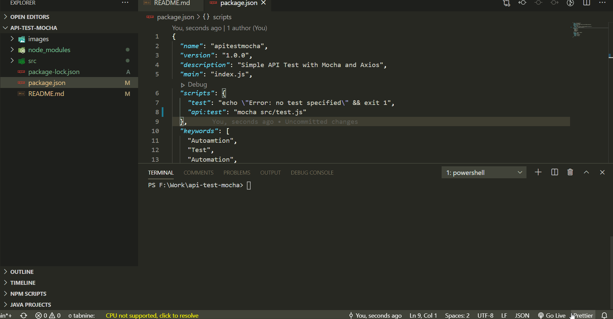

# api-test-mocha
Simple API testing with mocha, axios and chai

Steps to Execute:

1. Download & install the node
2. run `npm i` command in terminal where package.json is located
3. run `npm run api:test`
##### Note:

API used in this test suit are from https://reqres.in/
